# このアプリは

Android TV / Fire TV からEPGStationの録画を見るためのクライアントアプリです。

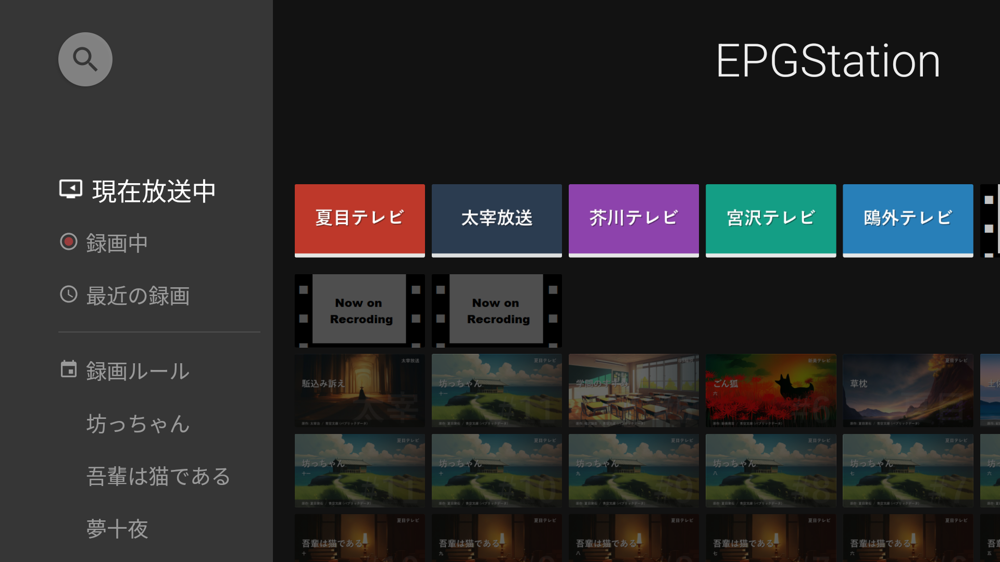

## 動作させるために必要なもの

| 項目 | 内容 |
|---|---|
| サーバー | EPGStation 1.x / 2.x（起動時に自動判定） |
| 対応端末 | Android TV  / Fire TV *1 |
| LAN | TS再生には 17Mbps(地デジ)~25Mbps(BS)程度のスループットが必要です |

>  Google TV ブランドの機種でも問題なく使えます。Vega OS ベースの Fire TV では動作しません。Fire TV は検索まわりの挙動が一部異なります(2.1節参照)。

## 目次

1. [メイン画面](#1-メイン画面)
2. [検索画面](#2-検索画面)
3. [番組詳細画面](#3-番組詳細画面)
4. [内蔵プレーヤー（再生画面）](#4-内蔵プレーヤー再生画面)
5. [設定画面](#5-設定画面)

---

## 1. メイン画面

### この画面は

起動して最初に表示されるホーム画面です。
ライブ視聴・録画中・最近の録画・検索履歴・録画ルール・設定が縦に並びます。
左側のサイドバーにはセクションごとのアイコン付き見出しがあり、↑↓ で行を切り替え、→ または 決定 でその行の中に入ってカードを選べます。

### 1.1 初回起動時の設定

はじめて起動したときは、EPGStationがどこにあるかをアプリに教える必要があります。設定が済むまで録画一覧は空のままで、数秒後に「EPGStationに接続できませんでした。設定メニューからIPアドレスを確認してください」と表示されます。

**1. メイン画面を一番下までスクロールし、設定 の行にある 接続設定 を選びます。**

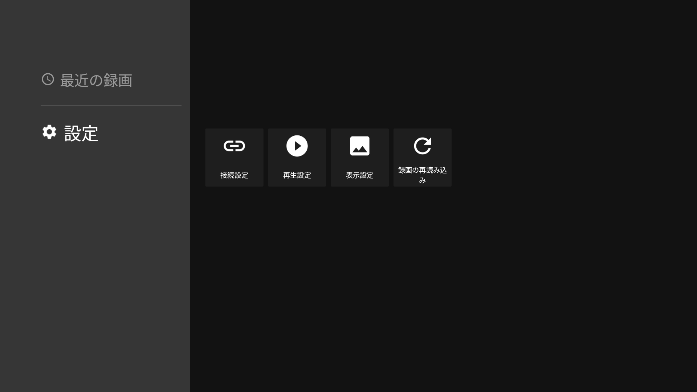

**2. EPGStationのIPアドレス に、EPGStationが動いているサーバのIPアドレスを入力します**（例: `192.168.11.7`）。初期値は `192.168.0.0` というダミーの値なので、必ず書き換えてください。

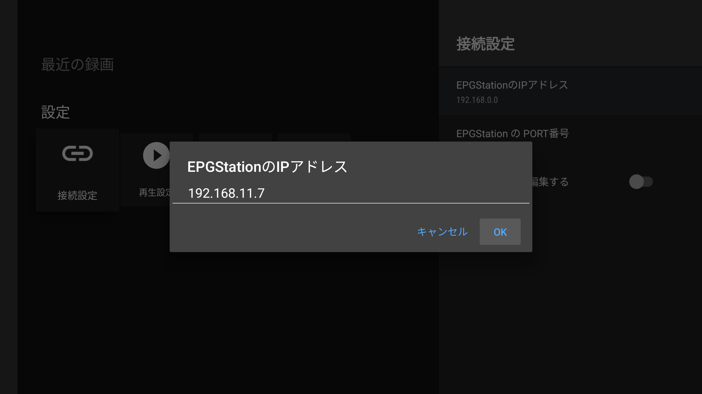

**3. EPGStationのPORT番号 を確認します。** 初期値は `8888` です。EPGStationを初期設定のまま使っているならそのままで大丈夫です。

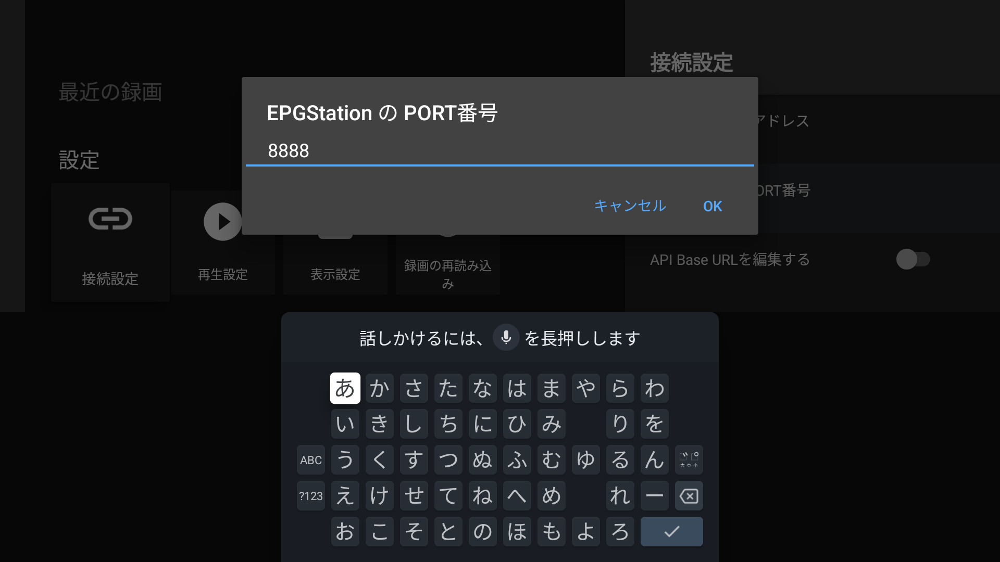

**4. 戻るボタンでメイン画面に戻ると、自動的に接続し直して録画一覧が読み込まれます。**

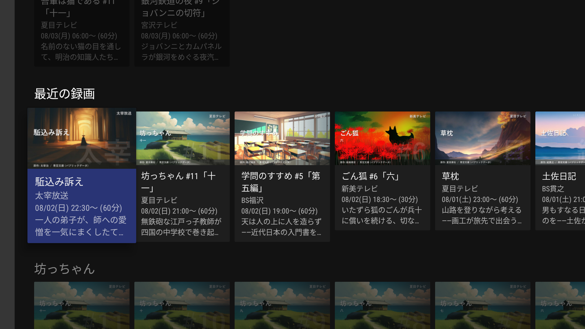

> リバースプロキシ経由で使っている場合や、URLにID・パスワードが必要な場合は、IPアドレスの代わりに「API Base URLを編集する」からURLを直接指定できます（5.1節参照）。

### 1.2 並んでいる行とできること

#### 現在放送中

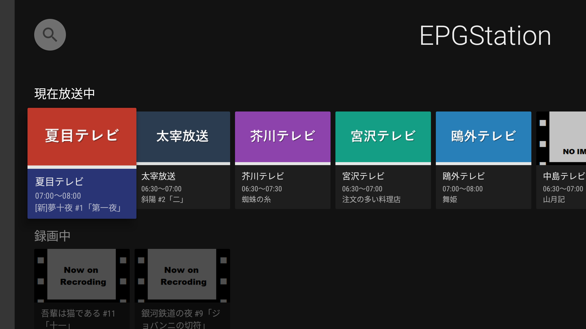

チャンネルごとに1枚のカードが並び、今その局で放送中の番組名と開始〜終了時刻が表示されます。番組が切り替わると表示も自動で切り替わります。ロゴ対応チャンネルは局ロゴが出ます。EPGStation 2.x をお使いの場合のみ表示されます。

**決定** を押すとTS再生が始まります。再生プロファイルは設定画面で変更できます。

#### 録画中

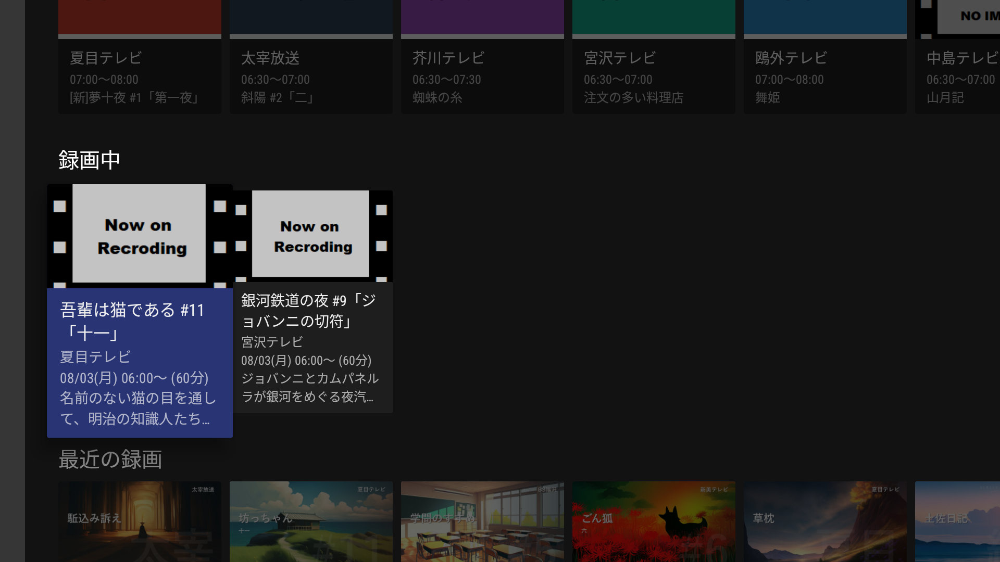

現在録画中の番組が並びます。録画中の番組が1件もないときは行自体が表示されません。サムネイルの代わりに「録画中」アイコンが出ます。EPGStation 2.x をお使いの場合のみ表示されます。

#### 最近の録画

録画済み番組が新しい順に並びます。右端までスクロールすると続きが自動で読み込まれ、際限なくスクロールできます。各カードには開始日時・録画時間・チャンネル名・説明文の冒頭が出ます。

#### 検索履歴

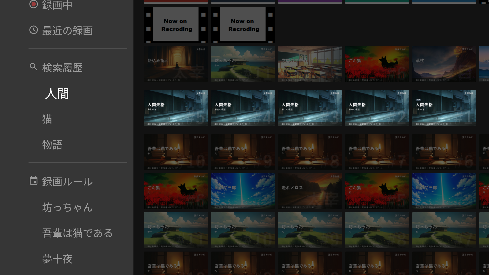

過去に検索したキーワードがそのまま行として並びます。選ぶと検索し直すことなく、その条件の録画一覧がすぐ開きます。表示件数は設定画面から変えられます。

#### 録画ルール

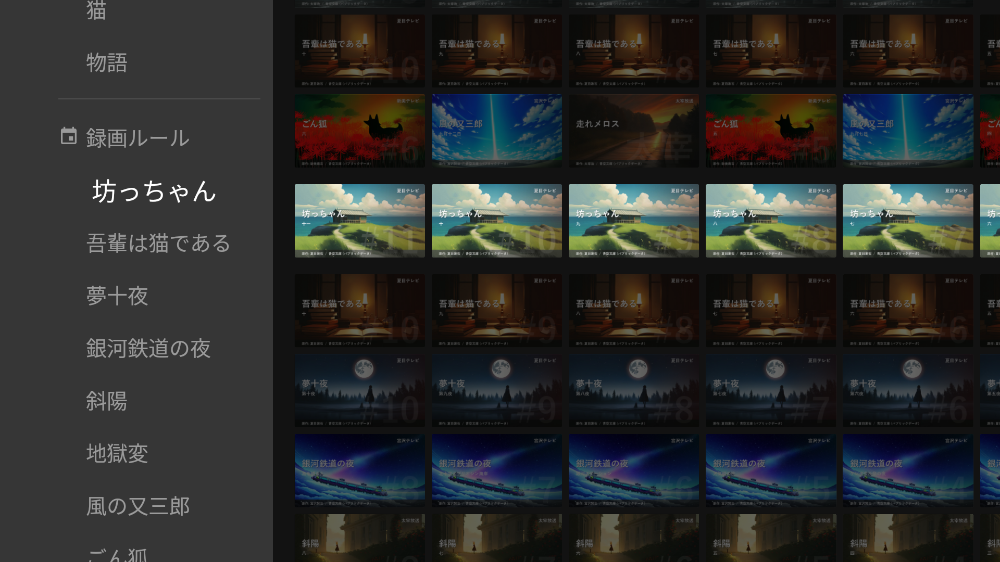

EPGStationに登録済みの自動録画ルールごとに1行並びます。キーワード未設定のルールは「ルールID ○○」と表示されます。ルールのソート順と、録画0件のルールを隠すかどうかは設定で切り替えられます。

#### 設定

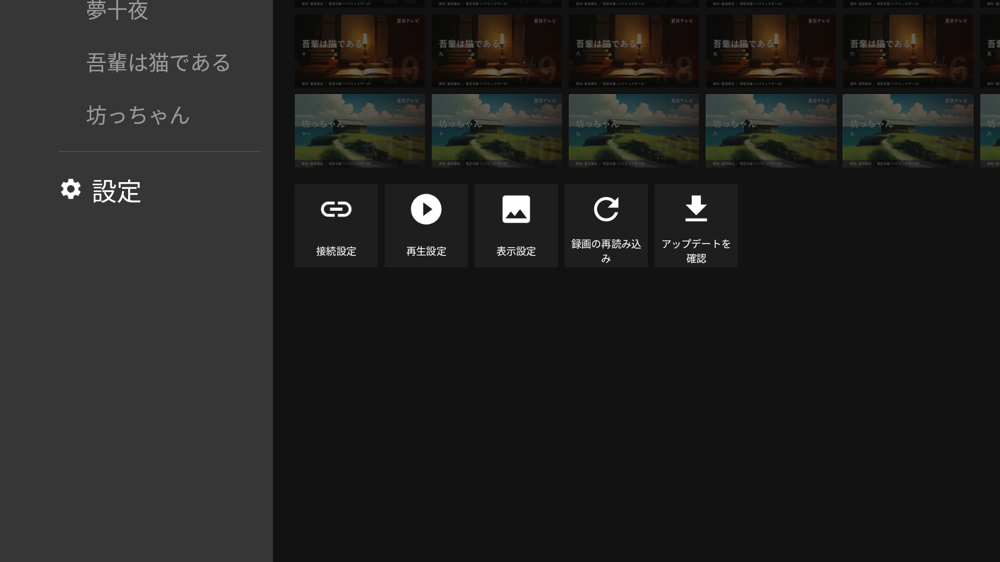

「接続設定」「再生設定」「表示設定」「再読み込み」の4枚のカードが並びます。前の3枚は選ぶとそのまま該当の設定画面へ直接移動します。「再読み込み」を選ぶと録画一覧が最新の状態になります。

### 1.3 カードに対するその他の操作

#### 放送中カードの長押し

「現在放送中」のカードを長押しすると、TS再生の代わりにHLS再生が始まります。再生プロファイルは設定画面で変更できます。

#### 録画カードの長押し

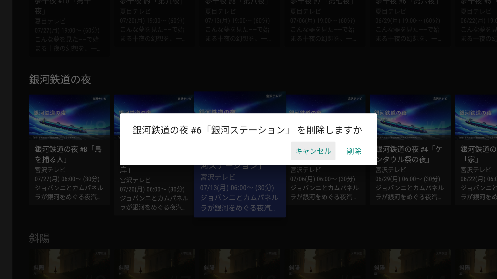

録画済みカードを長押しすると削除確認ダイアログが出ます。「削除」を選ぶとEPGStation側の録画も削除され、一覧からもその場で消えます。メイン画面・検索結果・詳細画面の関連動画、どのカード一覧からでも同じ操作で削除できます。

#### カードにフォーカス

選んだカードのサムネイルが拡大されます。設定によってサムネイルを背景に表示することもできます（背景表示はデフォルトはOFFです）。

#### 🔍アイコン

画面上部の🔍アイコンを選ぶと検索画面に移動します。

---

## 2. 検索画面

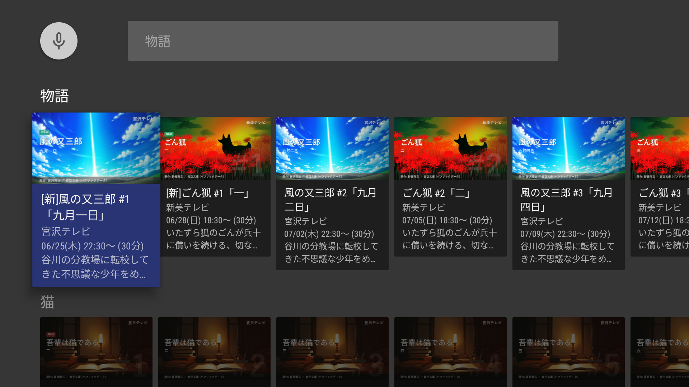

録画済みの番組すべてを対象に、キーワードで探せる画面です。検索したキーワードは履歴として残り、次にこの画面を開いたときには、その履歴ごとの検索結果が最新の状態で並びます。

### 2.1 入力した文字が何と照合されるか

入力した文字は **番組名** と **概要** から探されます。どちらかに含まれていれば見つかります。

| 照合される | 照合されない |
|---|---|
| 番組名 | 詳しい説明（番組情報の後半に出る長い解説） |
| 概要（番組名の下に出る短い説明） | チャンネル名・放送局名 |
| | 放送日・曜日・時間帯 |
| | ジャンル |

- スペースで区切って複数のキーワードを入れると、そのすべてを含む録画に絞り込まれます。
- 大文字と小文字、全角と半角は区別されません。「ＢＬＡＣＫ」「BLACK」「black」のどれで入力しても同じ結果になります。

放送局や日時では絞り込めないため、たとえば「NHK」で検索すると、番組名か概要にその文字が入っている録画だけが見つかります。NHKで放送された録画をすべて集める、という使い方はできません。

### 2.2 検索の操作と結果の見え方

- 文字入力または音声入力（リモコン内蔵マイク）で録画番組を検索できます。決定で検索を実行します。
- 検索結果は画面の一番上に新しい行として積み上がっていきます。続けて別のキーワードを検索すると、そのたびに新しい行が最上段に追加されます。
- ヒットする録画が1件もなかった場合は「"○○"を含む録画は見つかりませんでした」と表示され、空の行は残りません。
- 結果カードから詳細画面に進めます。長押しによる削除もメイン画面と同様に使えます。
- 検索するたびに自動的に検索履歴として保存されます（保存件数は表示設定で変えられます）。履歴はメイン画面の「検索履歴」行に並ぶほか、**この検索画面を開き直したときにも、過去の検索結果があらかじめ表示された状態で再現されます**。

> **Fire TVをお使いの場合**: 音声での検索は使えません。マイクのアイコンは表示されますが、押しても反応しません。リモコンで文字を入力してください。

---

## 3. 番組詳細画面

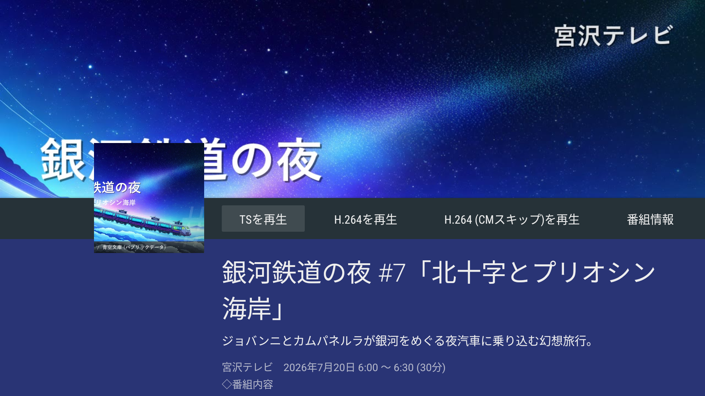

メイン画面や検索結果でカードを選ぶと開く画面です。
番組の情報が表示され、再生ができます。
関連する動画としてシリーズもののほかの録画のカードが表示されます。
時刻の表示は、端末の言語やタイムゾーンの設定に関わらず常に日本時間です。

### 3.1 表示される情報

- 番組タイトル・説明文（概要）・チャンネル名・開始〜終了時刻（録画時間つき）・詳しい番組説明が表示されます。
- サムネイルがない場合は、録画中なら「REC」アイコン、録画済みなら「NO IMAGE」アイコンが代わりに出ます。

### 3.2 再生ボタン

番組の上部に横一列で並びます。並ぶボタンは、その番組の録画が**終わっているか進行中か**で変わります。

#### 録画が終わっている番組

| ボタン | 表示条件 |
|---|---|
| TSを再生 | 変換前のオリジナル録画が残っている場合に表示されます。 |
| （エンコード設定の名前）を再生 | エンコード済みの動画があるとき、動画ごとに1つずつ表示されます。 *|
| 番組情報 | 常に表示されます。選ぶと下記の「番組情報ダイアログ」が開きます。 |

エンコード済の動画がある場合には 、EPGStation側でその動画を作ったときの**エンコード設定の名前**がついたボタンが表示されます。設定に「H.264」「H.264 (CMスキップ)」という名前を付けていれば、ボタンも「H.264を再生」「H.264 (CMスキップ)を再生」となります。同じ番組を複数の設定でエンコードしている場合は、その数だけボタンが並ぶので、画質やCMカットの有無を選んで再生できます。

#### 録画が進行中の番組

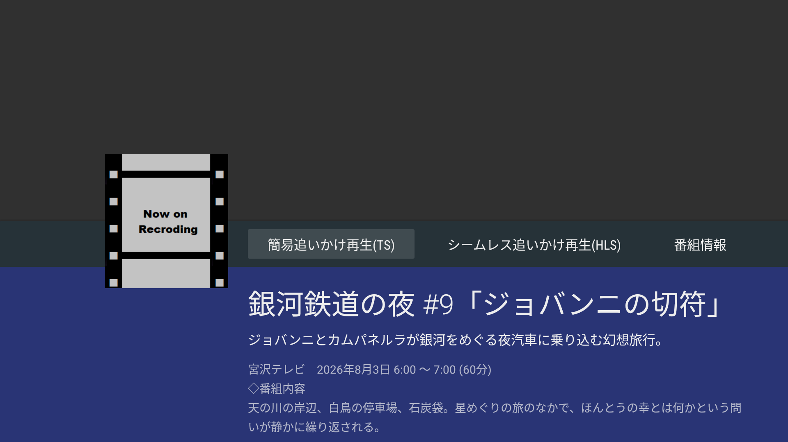

| ボタン | 表示条件 |
|---|---|
| 簡易追いかけ再生(TS) | 常に表示されます。録画中のファイルをそのまま再生します。 |
| シームレス追いかけ再生(HLS) | 設定で内蔵プレーヤーを選んでいる場合だけ表示されます。EPGStation側で変換しながら配信するため、録画の進行に自然に追従します。 |
| 番組情報 | 常に表示されます。 |

**2つの追いかけ再生の違い**

| | 簡易追いかけ再生(TS) | シームレス追いかけ再生(HLS) |
|---|---|---|
| 録画中の位置に追いついたとき | 再生が一度途切れ、少し戻ったところから続きが始まる「ギャップ」が発生します。追いつくたびに繰り返されます | 途切れずにそのまま続きが流れます |
| 画質 | 放送されたまま | EPGStation側の設定によります |
| 必要な回線速度 | 放送そのままの速度が必要です（1章参照） | 変換されるぶん軽くなります |
| 字幕・文字スーパー・副音声の切り替え | 使えます（設定が必要。4.2節参照） | 使えません |

番組録画開始直後からTSで追いかけ再生をするとギャップが何度も発生するのでHLSでの再生がおすすめです。半分以上収録が進んでいる場合はTSを選んでも1回ギャップが発生するだけで済みます。

#### 再生ボタンを選んだあと

設定画面の「再生設定」で **内蔵プレーヤー** が選ばれていればそのまま内蔵プレーヤーで再生が始まり、**外部プレーヤー**（MX Player / VLC）が選ばれていればそのアプリが起動します。外部プレーヤーが端末に入っていない場合は案内が出て、Playストアの該当アプリページが自動的に開きます。

### 3.3 関連動画（条件を満たすときだけ自動表示）

- **シリーズの続き** ― 番組名から「第3話」「(2)」「[新]」といった話数表記を取り除いた部分をシリーズ名とみなし、同じシリーズの他の録画を一覧表示します。話数表記のない番組名の場合はこの行が出ません。
- **同じルールの録画** ― この番組を録画した自動録画ルールで録れた、他の録画の一覧です。

### 3.4 番組情報ダイアログ

「番組情報」ボタンから開く、全文表示専用のポップアップです。

- チャンネル名・ジャンル/サブジャンル・開始〜終了時刻（分数つき）・概要・詳しい説明を続けて表示します。
- 長い説明文でも ↑↓ キーでスクロールでき最後まで読めます。
- 「閉じる」ボタンでダイアログを閉じます。

---

## 4. 内蔵プレーヤー（再生画面）

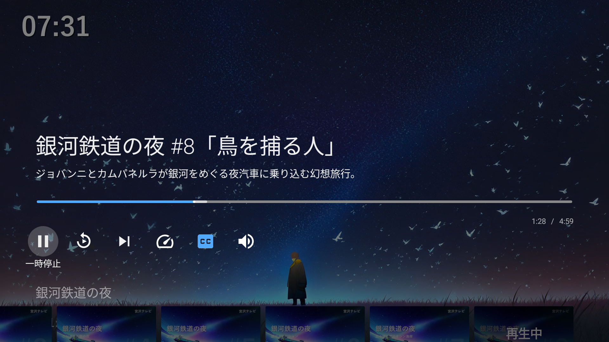

設定で「内蔵」プレーヤーを選んでいるときの再生画面です。
生TSでも軽快にシークでき、一般的な動画プレイヤーがあまりサポートしない日本の放送で使われる字幕/文字スーパー/副音声に対応しています。
ライブ視聴中は RECボタン で EPGStationに録画を指示できます。

どこから再生を始めたかによって、使える機能が変わります。

### 4.1 5つの再生パターン

| パターン | 内容 |
|---|---|
| TSを再生 | 変換前のオリジナル録画をそのまま再生します。シークできます。 |
| 簡易追いかけ再生(TS) | 録画が進行中の番組を、録画の進行に追いつきながら視聴します。 |
| エンコード済み動画を再生 | EPGStationで変換済みの動画を再生します。待ち時間なく自由にシークできます。 |
| シームレス追いかけ再生(HLS) | 録画が進行中の番組を追いかけ再生します。EPGStation側で変換しながら配信するため、録画の進行に自然に追従します。 |
| ライブ視聴 | メイン画面「現在放送中」のチャンネルカードから始める、放送中番組のライブ視聴です。 |

### 4.2 操作できるボタン

| 見た目 | ボタン | 内容 |
|:---:|---|---|
| ▶️ ⏸️ | 再生 / 一時停止 / シーク | 左右キーでシークバーを操作します。 |
| 💬 | CC(字幕) | 字幕のON/OFFを切り替えます。 |
| 🗒️ | SI(文字スーパー) | 文字スーパー（緊急地震速報などの臨時テロップ）の表示を切り替えます。押すたびに現在の状態が短く表示されます。 |
| 🔊 | Main / Sub（音声） | 主音声・副音声を切り替えます。二カ国語放送などでは、これで音声を選べます。**副音声のない番組でSubにすると無音になります**（切り替えを拒否する仕組みはありません）。音が出なくなったらMainに戻してください。 |
| ⏺️ | REC | ライブ視聴時のみ表示されます。押すとその場で今の番組の録画を予約し、ボタンが「REC...」に変わります。予約できたかどうかは画面で知らせます。 |
| ℹ️ | 番組情報 | ライブ視聴時のみ表示されます。視聴中チャンネルの番組名・ジャンル・時刻・概要をダイアログで確認できます。 |

アイコンの色で今の状態がわかります。**白は OFF / 主音声**、**水色は ON / 副音声** です。RECだけは中央が赤い丸で、押すと「REC...」の文字に変わります。

> **ボタンが出てこないときは**: ボタンは、そのとき実際に使えるものだけが表示されます。
>
> - **CC(字幕)** … 字幕が含まれているときに出ます。放送そのままのTS（「TSを再生」「簡易追いかけ再生(TS)」「ライブ視聴（単押し）」）では、設定画面の「再生設定 → TS処理 → ネイティブTS処理」がONのときだけ字幕を扱えます。**初期状態はOFF** なので、TSで字幕を見たい場合は先にこの設定をONにしてください。エンコード済み動画では、その動画に字幕が入っていれば設定に関わらず出ます。
> - **SI(文字スーパー)** … 日本の放送だけの仕組みのため、上記のTS再生でネイティブTS処理がONのときにのみ出ます。
> - **Main / Sub（音声）** … 音声が2つ以上含まれているときに出ます。1つしかない動画では出ません。
>
> シームレス追いかけ再生(HLS)では、いずれのボタンも表示されません。

**字幕・文字スーパー・音声の状態は記憶されます**

CC・SI・Main/Sub の3つは、切り替えるとその状態が保存され、次に再生を始めたときも同じ状態で始まります。番組ごとではなくアプリ全体で1つの設定として覚えるため、一度好みの状態にしておけば毎回押し直す必要はありません。

はじめて使うときは次の状態から始まります。

| ボタン | 最初の状態 |
|---|---|
| CC(字幕) | OFF |
| SI(文字スーパー) | ON |
| 音声 | Main（主音声） |

字幕を常に出しておきたい場合は、一度CCをONにすれば以降ずっとONのままです。逆に、副音声のない番組でSubのまま終了すると次回も無音から始まってしまうので、音が聞こえない場合はまずここを疑ってください。

### 4.3 シークの動作と制限

- **TSを再生**: 再生を始めた直後のごく短い間だけ、シークバーを操作できません。準備ができ次第、見たい場面へ自由に飛べます。ただし終わりの15秒以内には飛べません。
- **簡易追いかけ再生(TS)**: 録画済みのところまで再生し終わると、自動的にその時点の最新位置まで進み、そのまま録画の続きに追いつきます。録画が終わると通常の再生に戻ります。

### 4.4 レジューム再生（前回の続きから見る）

途中で見るのをやめた録画をもう一度再生すると、「前回再生を停止した位置から再開しますか？」というダイアログが画面に重なって表示されます。

| ボタン | 動作 |
|---|---|
| 最初から | ダイアログを閉じるだけです。そのまま頭から見られます。 |
| レジューム再生 | 前回やめた位置まで飛びます。**最初からこちらにフォーカスが当たっている**ので、決定を押すだけで続きから見られます。 |

どちらを選んでも、**再生自体はダイアログが出た時点ですでに先頭から始まっています**。ダイアログは半透明なので、裏で映像が流れているのが見えます。戻るボタンで閉じた場合は「最初から」を選んだのと同じ結果になりますが、記録は残るため次回もう一度開いたときには再び確認が出ます。

> 「TSを再生」「簡易追いかけ再生(TS)」では、シークの準備ができてから位置が移ります（4.3節参照）。「レジューム再生」を選んでから実際に飛ぶまで数秒かかることがあります。

**どこまで見たかが記録されるタイミング**

| | |
|---|---|
| 記録されるとき | 再生画面を離れたとき（戻るボタン・ホームボタン）のその位置 |
| 記録されないとき | 再生開始から10秒に満たないうちに離れたとき。このとき**前回の記録は消えずにそのまま残ります**（ダイアログを見て何も選ばずに戻ってしまっても、続きの位置は失われません） |
| 記録が消えるとき | 終わりの15秒以内まで見たとき（最後まで見た録画には次回から確認が出ません）／「最初から」を選んだとき |

- 記録は動画ごとに別々に残ります。同じ番組でも「TSを再生」とエンコード済み動画とでは別の位置として扱われます。
- **ライブ視聴** と **シームレス追いかけ再生(HLS)** は対象外です。前回の位置に意味がないため、確認は出ません。
- ダイアログを出すかどうかは、設定画面の「再生設定 → レジューム再生」で切り替えられます（**初期状態はON**。5.2節参照）。

---

## 5. 設定画面

画面の右側にせり出す形で表示されます。メイン画面の「設定」行の各カードから、対応する画面へ直接ジャンプできます。3つに分かれています。

### 5.1 接続設定

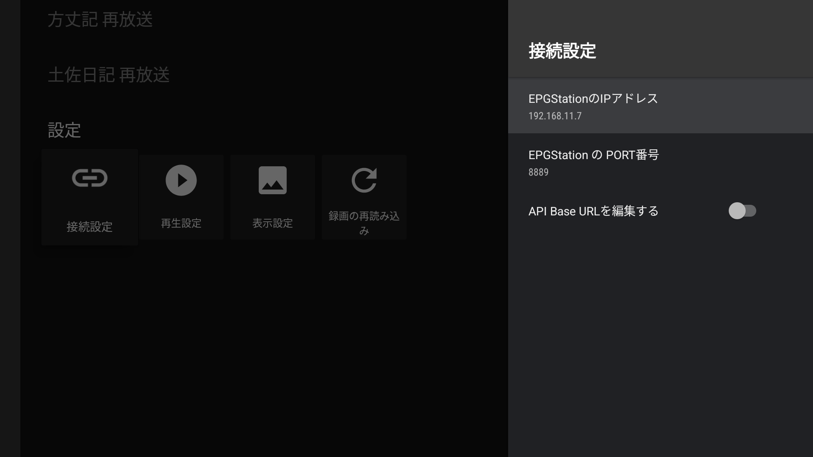

- EPGStationの **IPアドレス** と **ポート番号** を指定します。入力した値が正しい形式かその場でチェックされ、誤っていれば警告が出て保存されません。
- 「API Base URLを編集する」をONにすると、IPアドレスとポート番号の代わりに **URLを直接** 指定できます。リバースプロキシ経由で使っている場合や、URLにID・パスワードを含める必要がある場合はこちらを使います。この機能はある時点からまったく検証できていません。別拠点のEpgStationへのアクセスはWireguardの併用をお勧めします。
- 接続先を変更して画面を閉じると、メイン画面に戻ったときに自動で再接続され、録画一覧が読み込み直されます。

### 5.2 再生設定

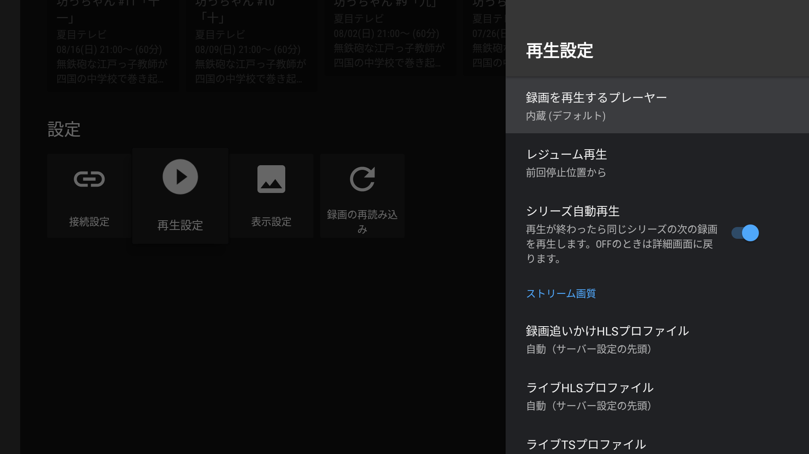

- **録画を再生するプレーヤー**: 内蔵（初期設定） / MX Player / MX Player Pro / VLC から選べます。
- **レジューム再生**: 前回停止した位置から再開するかどうかの確認ダイアログを出すスイッチです。**初期状態はON**。内蔵プレーヤーの機能のため、上の「録画を再生するプレーヤー」で内蔵を選んでいるときだけ表示されます（4.4節参照）。
- **ストリーム画質**: 追いかけ再生やライブ視聴の画質を、EPGStationサーバー側で設定した名前のまま選べます。「自動」を選んでおけば設定は不要です。
- **ネイティブTS処理**: 字幕・文字スーパー・副音声の切り替え・TSの安定化処理を使うかどうかのスイッチです。初期状態はOFFで、ONにすると内蔵プレーヤーがTSを安定的に再生できるようになるほか、CC・SI・音声のボタンが出ます（4.2節参照）。

> **ネイティブTS処理をONにする前に**: 一部の機種で、ONにするとアプリが終了する/OSが再起動するという報告があります。原因は特定できておらずすべての機種で起きるわけでもないため、初期状態をOFFにしたうえで、必要な方が自分で切り替えられる設定として用意しています。
>
> ONにして不安定になった場合はOFFに戻してください。OFFのあいだは、放送そのままのTSを再生するときに字幕・文字スーパー・副音声の切り替えが使えなくなります（エンコード済み動画には影響しません）。

### 5.3 表示設定

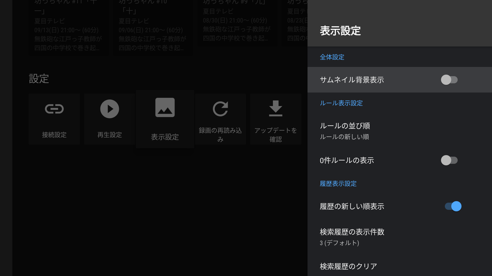

- **全体設定**: サムネイル背景表示のON/OFF、ルール/検索履歴の新しい順表示のON/OFFを切り替えます。
- **ルール表示設定**: 録画が0件の録画ルールを一覧に表示するかどうかを切り替えます。
- **履歴表示設定**: 検索履歴の表示件数を選べます（0/1/2/3/5/8/13/21件）。検索履歴を今すぐ全部消すボタンもあります。

